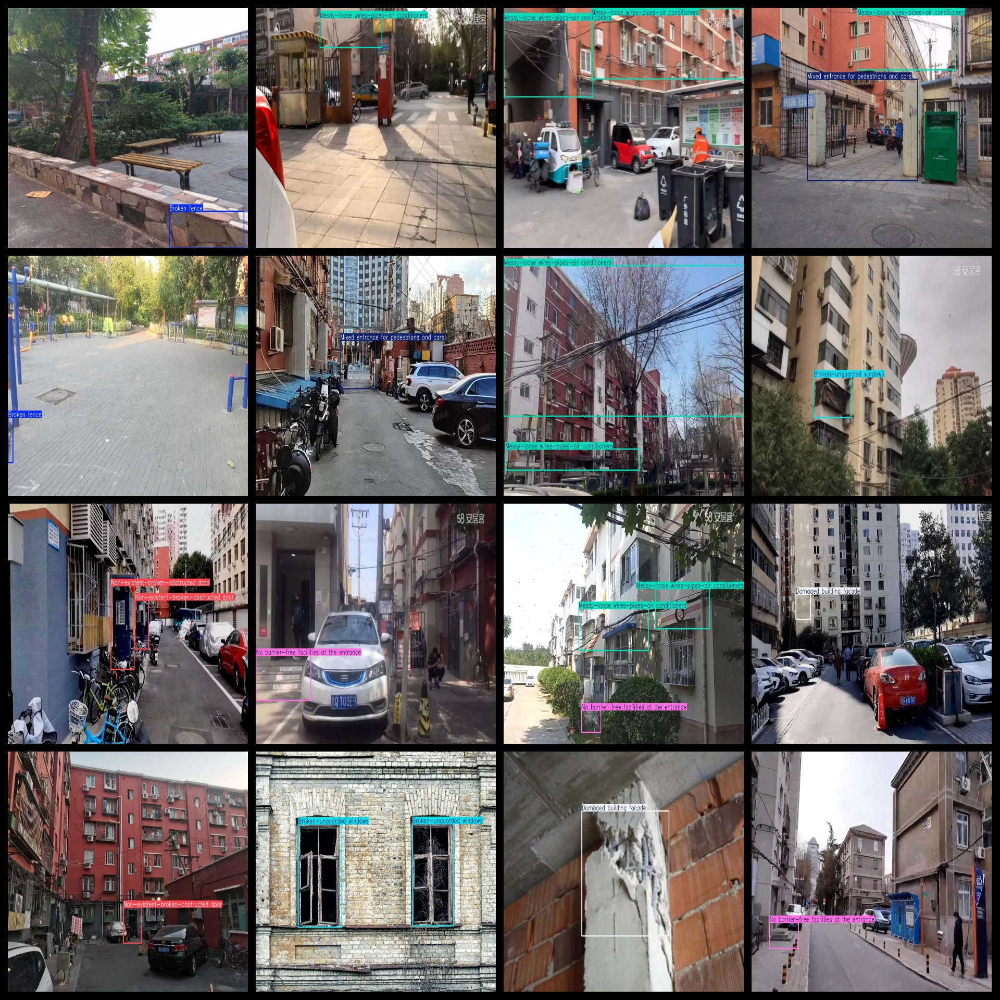
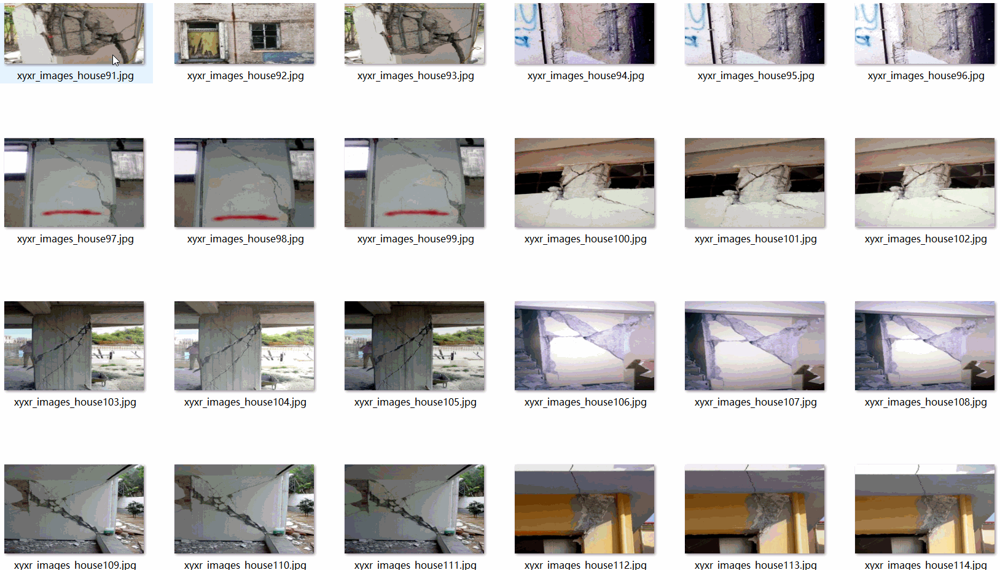

# Building Defect Dataset 6808 imagesVOC+YOLO format

The dataset consists of 6808 images in VOC and YOLO format, divided into three folders for storing images, xml files, and txt files. The JPEGImages folder contains a total of 6808 jpg images, the Annotations folder has a total of 6808 xml files, and the labels folder has a total of 6808 txt files. There are a total of 7 label categories: "Broken fence", "Broken-unguarded windows", "Damaged building facade", "Messy-loose wires-pipes-air conditioners", "Mixed entrance for pedestrians and cars", "No barrier-free facilities at the entrance", and "Non-existent-broken-obstructed door".

The label categories are as follows: "Broken Fence, Broken Unprotected Windows, Damaged Building Exterior, Dirty and Loose Wiring - Plumbing-Air Conditioning Equipment, Entry with Mixed Traffic, Entry without Accessible Facilities, No - Broken - Blocked Doors".

Each label category has a corresponding number of bounding boxes (please note that the order of bounding box classes in the YOLO format does not match this, but is based on the labels folder's classes.txt file):

- Broken fence: 467
- Broken-unguarded windows: 1571
- Damaged building facade: 3183
- Messy-loose wires-pipes-air conditioners: 3427
- Mixed entrance for pedestrians and cars: 975
- No barrier-free facilities at the entrance: 928
- Non-existent-broken-obstructed door: 845

Total bounding box count: 11396

The image resolution is clear, with a resolution of pixels. The images have been enhanced.

The shape of the labels is rectangular boxes, used for target detection recognition.

Important Notes: There are no special declarations made regarding the precision of the trained models or the weight files. The dataset only provides accurate and reasonable annotations.

Annotation and Image Details:
## Images

---

Here is a pay link on Stripe (https://buy.stripe.com/3cs8yP7sY87d0vu9AB). Please contact me lonlonago@foxmail.com after funding $89, and I will send you a complete data files, thank you!

